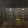

## Pytorch version of Parallel Actor Critic

Tried to solve the MinecraftBasic-v0 task using A2C.
Gym environment code are copied and modified from https://github.com/openai/baselines.

## Requirements
1. gym: https://github.com/openai/gym
2. minecraft-py: https://github.com/tambetm/minecraft-py
3. gym_minecraft: https://github.com/tambetm/gym-minecraft
4. pytorch: https://github.com/pytorch/pytorch

python 2.7 is preferred if we want to use minecraft-py.

## Run

1. Minecraft environment:
python run_minecraft.py

2. LunarLander environment:
python run_lunarlander.py

The parameters can be adjusted like number of processes, gamma value, learning rate, etc.

## Results

1. Minecraft:

The recorded results from episode 0(failed), 400, 800, 1200, 1600, 2000, 2400, 2800, 3200, 3600.
As we can see, the last episode can quickly navigate to the goal. However, the result is not so
promising, the agent still needs more than 20 steps to reach the goal. After the second iteration, the agent soon found a sub-optimal policy.

Averaged rewards:

2. LunarLander:
In progress....

## Issues:

Unlike Atari or other openai environments, Minecraft will not stop and wait for the agent to execute an action. Therefore, 
agents are missing lots of observations if opening too many processes. This will degrade the performance as discussed in 
https://github.com/tambetm/gym-minecraft/issues/3

We can set the tick to a higher value in task markdown.
